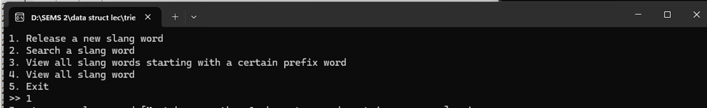
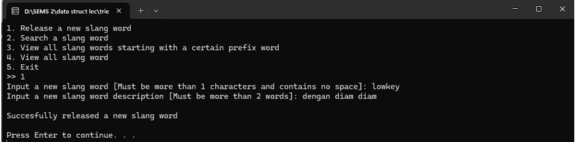
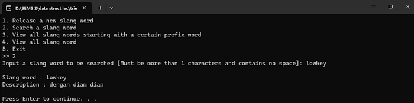
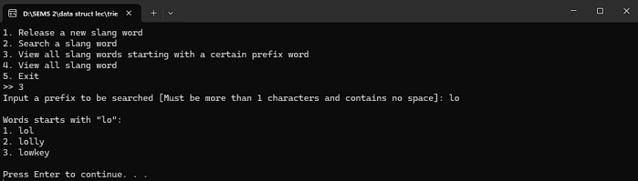
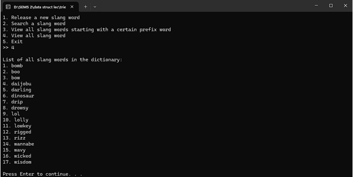

# Slang Word Dictionary (Trie Implementation)


This project is an implementation of the **Trie data structure** in C, designed to create a slang word dictionary.  
The program allows users to add new slang, search for specific slang, view slang words by prefix, and display all stored slang.

---

## 📌 Features
1. **Release a new slang word**  
   Add a new slang word with its description into the Trie.
2. **Search a slang word**  
   Search for a slang word and display its description.
3. **View all slang words starting with a certain prefix**  
   Display all slang words beginning with a given prefix.
4. **View all slang words**  
   Display all slang words stored in the Trie.
5. **Exit**  
   Exit the program.

---

## 🔧 Requirements
- A C++ compiler (GCC, MinGW, or Clang)
- Works on **Windows, Linux, or macOS**

---

## 🏗️ Data Structure
The program uses a **Trie** consisting of:
- `character` → stores a character at the node.
- `desc` → stores the slang description.
- `word` → marks the end of a valid word.
- `children[128]` → pointers to child nodes based on ASCII values.

---

## ⚙️ Key Functions
### Insert a Word
```c
void insertWord(struct trieNode *root, char str[], char desc[]) {
    if (*str == '\0') {
        root->word = 1;
        strcpy(root->desc, desc);
    } else {
        char lower = tolower(*str);
        int idx = (int) lower - 'a';
        if (root->children[idx] == NULL) {
            root->children[idx] = createNode(lower);
        }
        insertWord(root->children[idx], str + 1, desc);
    }
}
```

### Search a Word
```c
void searchSlang(struct trieNode *root, char search[]) {
    struct trieNode *curr = root;
    for (int i = 0; search[i] != '\0'; i++) {
        int idx = search[i] - 'a';
        if (curr->children[idx] == NULL) {
            printf("Word not found.\n");
            return;
        }
        curr = curr->children[idx];
    }
    if (curr != NULL && curr->word == 1) {
        printf("Slang word: %s\n", search);
        printf("Description: %s\n", curr->desc);
    } else {
        printf("Word not found.\n");
    }
}
```

### Viewing Words by Prefix
```c
void searchPrefix(){
	char search[1001];

	int spaceflag = 0;
	
	do{
		printf("Input a prefix to be searched [Must be more than 1 characters and contains no space]: ");
		scanf("%[^\n]", search);
		getchar();
		spaceflag = hasSpace(search); 
	}while(strlen(search) <= 1 || spaceflag == 0);
	
	char kata[1001];
	angka = 1;
	
	searchSlangPrefix(root, kata, 0, search);
	
	if(angka == 1){
		printf("\nThere is no prefix \"%s\" in the dictionary.\n", search);
	}
}

void searchSlangPrefix(struct trieNode *curr, char buffer[], int depth, char search[]){
	if(curr->word && strncmp(buffer, search, strlen(search)) == 0){
		if(angka == 1){
			printf("\nWords starts with \"%s\":\n", search);

		}
		buffer[depth] = '\0';
		printf("%d. %s\n", angka, buffer);
		angka++;
		
	}
	
	for(int i = 0 ; i < 128 ; i++){
		if(curr->children[i] != NULL){
			buffer[depth] = i + 'a';
			searchSlangPrefix(curr->children[i], buffer, depth + 1, search);
		}
	}
}
```
### View All Slang 
```c
void printAll(struct trieNode *curr, char buffer[], int depth){
	if(curr->word == 1){
		buffer[depth] = '\0';
		printf("%d. %s\n", angka, buffer);
		angka++;
	}
	
	for(int i = 0 ; i < 128 ; i++){
		if(curr->children[i] != NULL){
			buffer[depth] = i + 'a';
			printAll(curr->children[i], buffer, depth + 1);
		}
	}
```

---

## ▶️ Usage Example
```
1. Release a new slang word
2. Search a slang word
3. View all slang words starting with a certain prefix
4. View all slang words
5. Exit
>> 1
Input a new slang word [Must be more than 1 characters and contains no space]: lol
Input a new slang word description [Must be more than 2 words]: laughing out loud
Successfully released a new slang word
```

---

## 🖼️ Example Screenshots
### Main Menu


### Adding a New Slang Word


### Searching for a Slang Word


### Viewing Words by Prefix


### Viewing All Slang Words


---

## 🤝 Contributing
Pull requests are welcome. For major changes, please open an issue first to discuss what you would like to change.

---

## 📄 License
This project is licensed under the MIT License - see the [LICENSE](LICENSE) file for details.
